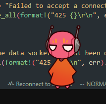

<div align="center">
    <h1><b>F</b>ive <b>T</b>iny <b>P</b>ebbles - FTP Server</h1>
    Now serving files from the Rubicon!
</div>

<br>

This project is a tiny yet efficient FTP server written in Rust, supporting a variety of FTP commands for file transfer and directory management.

## Table of Contents

* [Features](#features)
* [Usage](#usage)
* [Supported FTP Commands](#supported-ftp-commands)
* [Logging](#logging)
* [More info](#more-info)

## Features
- **File Uploads**: Supports storing files on the server.
- **File Downloads**: Retrieve files from the server.
- **Resume Transfers**: Resume interrupted uploads or downloads.
- **Delete Files**: Remove files from the server.
- **Active and Passive Modes**: Supports both `PORT` (active mode) and `PASV` (passive mode).
- **Anonymous Logins**: Supports anonymous access for guest users (optional).
- **Custom Authentication**: Authenticate with `USER` and `PASS` commands for secure access.
- **Standards Compliance**: Implements core FTP commands to ensure compatibility with most FTP clients.

## Usage
Ensure you have the Rust toolchain installed, `cd` into the server's folder, and then either run in release mode:
```
cargo build --release
cargo run --release
```
Or run in development mode with `cargo run`.

For more help and configuration options, use `cargo run -- --help`

## Supported FTP Commands

### Authentication
- **USER [username]**
Sends the username to the server.
Response: `331 Username okay, need password.`

- **PASS [password]**
Sends the password to the server.
    - If authentication succeeds: `230 User logged in, proceed.`
    - If authentication fails: `530 Not logged in. Authentication failed.`

### System Information
- **SYST**
Returns the server's operating system type.
Example response:
    - `215 Windows_NT` (on Windows)
    - `215 UNIX Type: L8` (on other systems)

- **FEAT**
Lists the features supported by the server.
Example response:
    * 211 Features:
    * UTF8
    * 211 End

### Directory Management
- **PWD**
Returns the current working directory.
Response: `257 "[directory]" is the current directory.`

- **CWD [directory]**
Changes the working directory.
Response: `250 Directory successfully changed.`

- **CDUP**
Moves to the parent directory.
Response: `250 Directory successfully changed.`

### File Transfers
- **TYPE [A/I]**
Sets the transfer type: ASCII (`A`) or Binary (`I`).
Response:
    - `200 Type set to A`
    - `200 Type set to I`

- **PASV**
Enters Passive Mode for file transfer.
Response: `227 Entering Passive Mode (h1,h2,h3,h4,p1,p2)`

- **PORT [address]**
Specifies the client's data port for Active Mode.
Response: `200 PORT command successful.`

- **LIST**
Sends a directory listing.
Response:
    - `150 Sending directory list`
    - `226 Directory send OK`

- **RETR [filename]**
Downloads a file from the server.
Response:
    - `150 Opening data connection`
    - `226 Transfer complete`

- **STOR [filename]**
Uploads a file to the server.
Response:
    - `150 Opening data connection`
    - `226 Transfer complete`

- **APPE [filename]**
Appends data to an existing file.
Response:
    - `150 Opening data connection`
    - `226 Transfer complete`

- **REST [offset]**  
Resumes a file transfer at the specified offset.  
Response: `350 Restarting at specified offset.`  

### Other Commands
- **DELE [filename]**  
Deletes a file on the server.  
Response: `250 File deleted.`  

- **OPTS REST STOR**
Indicates support for resuming file uploads.
Response: `200 Resuming file uploads supported.`

- **Unsupported Commands**
Any unimplemented command returns: `502 Command not implemented.`

## Logging
The server uses `tracing` for detailed logging of all activities. Logs include information such as received commands, authentication status, and file transfer operations.

## More info
This server was built for the web protocols course of the third trimester of 2024 at [Universidad Rafael Urdaneta](https://en.wikipedia.org/wiki/Rafael_Urdaneta_University) by Javier Pérez [(Kaucrow)](https://github.com/Kaucrow)

<br>

<div align="center">
    <p>Special thanks:</p>
    
</div>